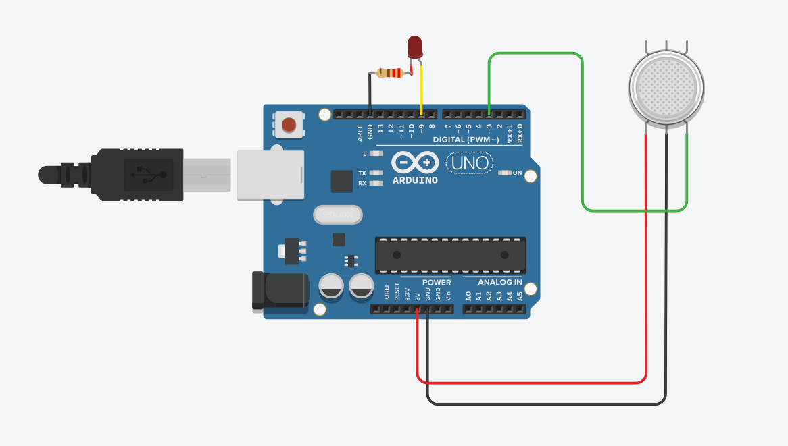

# Title
Alcohol Detection System 

# Problem Statement
Develop a microcontroller-based prototype that detects drink-and-drive situations by sensing if a driver has consumed alcohol. This enhances road safety by preventing accidents caused by drunk driving.

## Scope of the Solution
To implement an affordable and real-time alcohol detection system using an MQ3 sensor and Arduino. The system should detect alcohol and trigger an alert system like a buzzer or LED.

## Required Components
- Arduino UNO board
- MQ3 Alcohol Sensor
- Jumper wires
- Breadboard
- Buzzer or LED
- USB cable
- Arduino IDE (software)
- Fritzing or TinkerCad for circuit simulation
- PCB Design Software (for Gerber file)

## Simulated Circuit
Design your circuit on TinkerCad or Fritzing and attach the screenshot here!

## Simulated Circuit Diagram
 <!-- Replace with your actual image file name -->

## Code
The Arduino code is available in the `Arduino_Code` folder.

## Gerber Files
The Gerber files for PCB fabrication are available in the `Gerber_Files` folder.

## Demo Video
[Click here to watch the demo video](https://YOUR_VIDEO_LINK_HERE) <!-- Replace with your video link -->

## Aim
The aim is to develop a working prototype that reliably detects alcohol levels in the driver’s breath.

## Results
The system successfully detects alcohol presence and activates an alert to prevent vehicle ignition.
